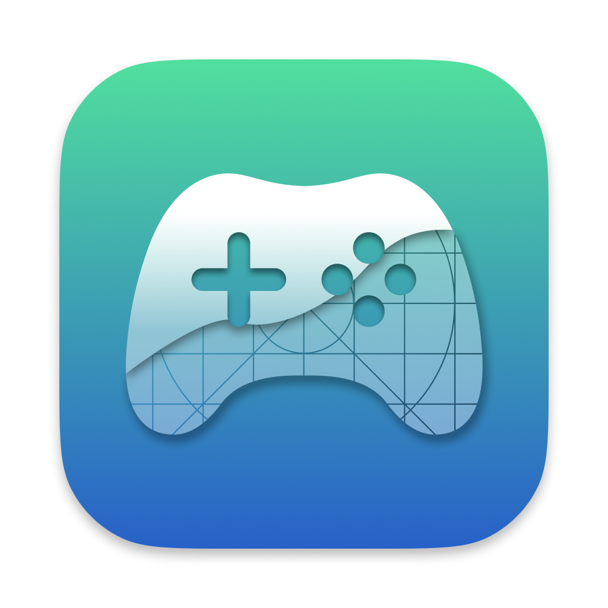

<div id="top"></div>

‎<h1 align="center">[![Contributors][contributors-shield]][contributors-url]
[![Forks][forks-shield]][forks-url]
[![Stargazers][stars-shield]][stars-url]
[![Issues][issues-shield]][issues-url]
[![GPLv3 License][license-shield]][license-url]
</h1>


<!-- PROJECT LOGO -->
<br />
<div align="center">
    
  </a>

  <h3 align="center">iosEmu</h3>

  <p align="center">
    Run iOS apps and games on Apple Silicon Macs with mouse, keyboard and controller support.
    <br />
    <br />
    <a href="https://iosEmu.github.io/PlayBook">Documentation</a>
    ·
    <a href="https://discord.gg/rMv5qxGTGC">Discord</a>
    ·
    <a href="no website yet">Website</a>
  </p>
</div>

<!-- ABOUT THE PROJECT -->
## About The Project

Welcome to iosEmu! This software is all about allowing you to run iOS apps and games on Apple Silicon devices running macOS 12.0 or newer.

iosEmu works by putting applications through a wrapper which imitates an iPad. This allows the apps to run natively and perform very well.

iosEmu also allows you to map custom touch controls to keyboard, which is not possible in alternative sideloading methods such as Sideloadly. 

These controls include all the essentials, from WASD, camera movement, left and right clicks, and individual keymapping, similar to a popular Android emulator’s keymapping system called Bluestacks.

This software was originally designed to run Genshin Impact on your Apple Silicon device, but it can now run a wide range of applications. Unfortunately, not all games are supported, and some may have bugs.

Localisations handled in [Weblate](https://hosted.weblate.org/projects/iosEmu/).


<p align="right"><a href="#top">⬆️ Back to top️</a></p>

<!-- GETTING STARTED -->
## Getting Started

Follow the instructions below to get Genshin Impact, and many other games, up and running in no time.

### Prerequisites

At the moment, iosEmu can only run on Apple Silicon Macs. Devices with the following chips are supported:

* M1
* M1 Pro
* M1 Max
* M1 Ultra
* M2
* M2 Pro
* M2 Max
* M2 Ultra
* M3
* M3 Pro
* M3 Max

If you have an Intel Mac, you can explore alternatives like Bootcamp or emulators.

### Download

You can download stable releases [here](https://github.com/iosEmu/iosEmu/releases), or build from source by following the instructions in the Documentation.

### Documentation

To learn how to setup and use iosEmu, visit the documentation [here](https://iosEmu.github.io/PlayBook).

### Homebrew Cask
We host a [Homebrew](https://brew.sh) tap with the [iosEmu cask](https://github.com/iosEmu/homebrew-iosEmu/blob/master/Casks/iosEmu-community.rb). To install from it run:

```sh
brew install --cask iosEmu/iosEmu/iosEmu-community
```

To uninstall:
1. Remove iosEmu using `brew uninstall --cask iosEmu-community`;
2. Untap `iosEmu/iosEmu` with `brew untap iosEmu/iosEmu`.

<p align="right"><a href="#top">⬆️ Back to top️</a></p>


<!-- LICENSE -->
## License

Distributed under the GPLv3 License. See `LICENSE` for more information.


<!-- CONTACT -->
## Contact

Lucas Lee - iosEmu@lucas.icu

Depal - depal@iosEmu.io


<!-- ACKNOWLEDGMENTS -->
## Libraries Used

These open source libraries were used to create this project.

* [inject](https://github.com/paradiseduo/inject)
* [PTFakeTouch](https://github.com/Ret70/PTFakeTouch)
* [DownloadManager](https://github.com/shapedbyiris/download-manager)
* [DataCache](https://github.com/huynguyencong/DataCache)
* [SwiftUI CachedAsyncImage](https://github.com/lorenzofiamingo/swiftui-cached-async-image)

* Thanks to @iVoider for creating such a great project!

<p align="right"><a href="#top">⬆️ Back to top️</a></p>


<!-- MARKDOWN LINKS & IMAGES -->
[contributors-shield]: https://img.shields.io/github/contributors/iosEmu/iosEmu.svg?style=for-the-badge
[contributors-url]: https://github.com/iosEmu/iosEmu/graphs/contributors
[forks-shield]: https://img.shields.io/github/forks/iosEmu/iosEmu.svg?style=for-the-badge
[forks-url]: https://github.com/iosEmu/iosEmu/network/members
[stars-shield]: https://img.shields.io/github/stars/iosEmu/iosEmu.svg?style=for-the-badge
[stars-url]: https://github.com/iosEmu/iosEmu/stargazers
[issues-shield]: https://img.shields.io/github/issues/iosEmu/iosEmu.svg?style=for-the-badge
[issues-url]: https://github.com/iosEmu/iosEmu/issues
[license-shield]: https://img.shields.io/github/license/iosEmu/iosEmu.svg?style=for-the-badge
[license-url]: https://github.com/iosEmu/iosEmu/blob/master/LICENSE
